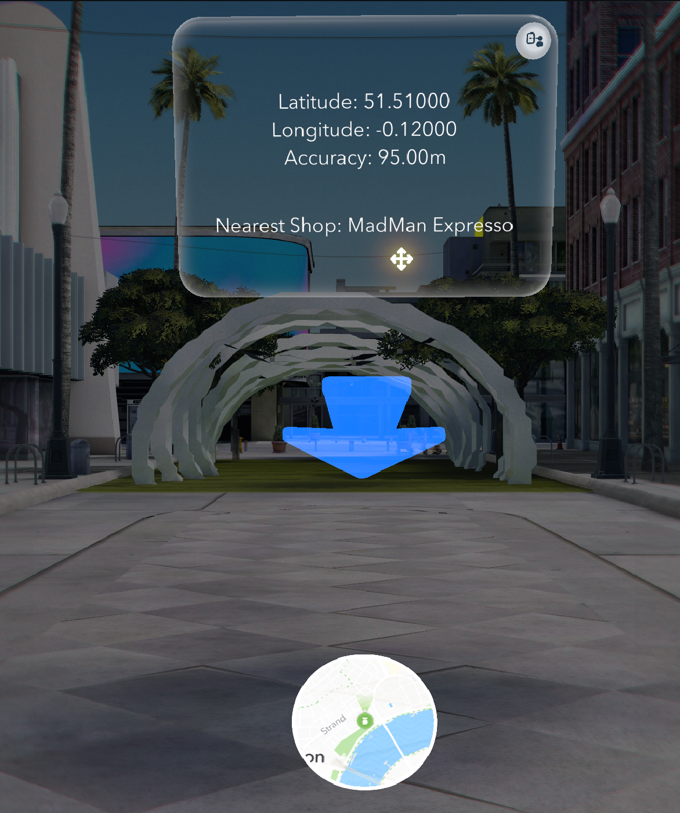

# Snap Spectacles Navigation Project



## Overview

This project utilizes Snap Spectacles to provide seamless geonavigation instructions. By integrating augmented reality, the system points to the desired location on a map and offers real-time guidance.

## Features

- **Augmented Navigation**: Visual indicators point towards the destination.
- **Geospatial Data**: Displays latitude, longitude, and navigation accuracy.
- **Nearest Points of Interest**: Highlights nearby shops and landmarks.
- **Real-Time Mapping**: Offers an interactive mini-map for better orientation.

## Installation

1. Clone this repository:
   ```bash
   git clone <repository-url>
   ```
2. Ensure Snap Spectacles SDK is properly configured on your system.
3. Place the `cover.png` file in the root folder for reference.

## Usage

- Open the app through your Snap Spectacles.
- Input your desired location or select a predefined point of interest.
- Follow the AR pointer and on-screen instructions for navigation.

## Contributing

We welcome contributions! Please fork the repository and submit a pull request for any improvements.

## References

- [Reddit Discussion on Spectacles](https://www.reddit.com/r/Spectacles/comments/1gzqzrs/comment/lz1m4t3/?utm_source=share&utm_medium=web3x&utm_name=web3xcss&utm_term=1&utm_content=share_button&rdt=39335)
- [Snap Lens Studio - Map Component](https://developers.snap.com/lens-studio/features/location-ar/map-component)
- [Lens Studio API - Map Module](https://developers.snap.com/lens-studio/api/lens-scripting/classes/Built_In.MapModule.html)
- [Lens Studio API - Location Service](https://developers.snap.com/lens-studio/api/lens-scripting/classes/Built_In.LocationService.html)

---

Created with Snap Spectacles and AR Geonavigation.